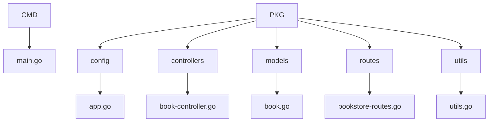
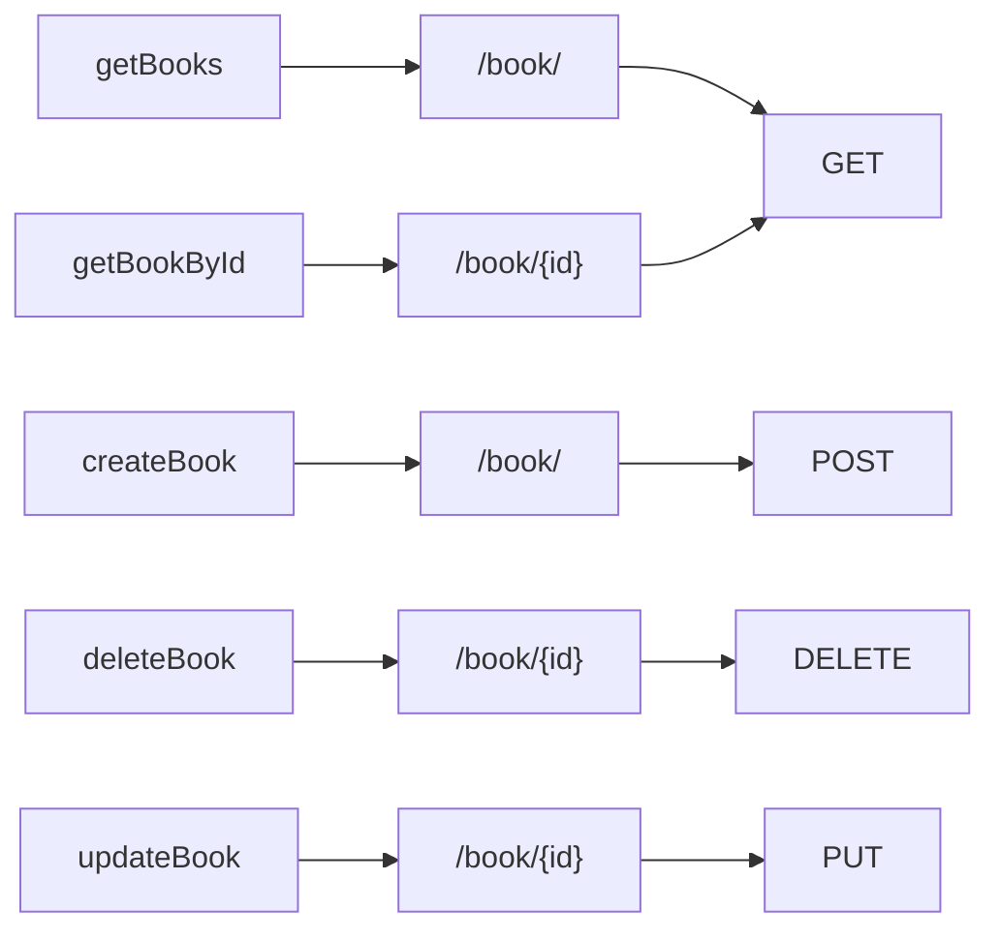

# Go CRUD API Book Server

SIMPLE CRUD API linked up to MySQL

## Libraries Used

* Database - MySQL
* GORM
* json marshall, unmarshall
* Project Structure
* Gorilla Mux

## Project Structure

## Routes

  